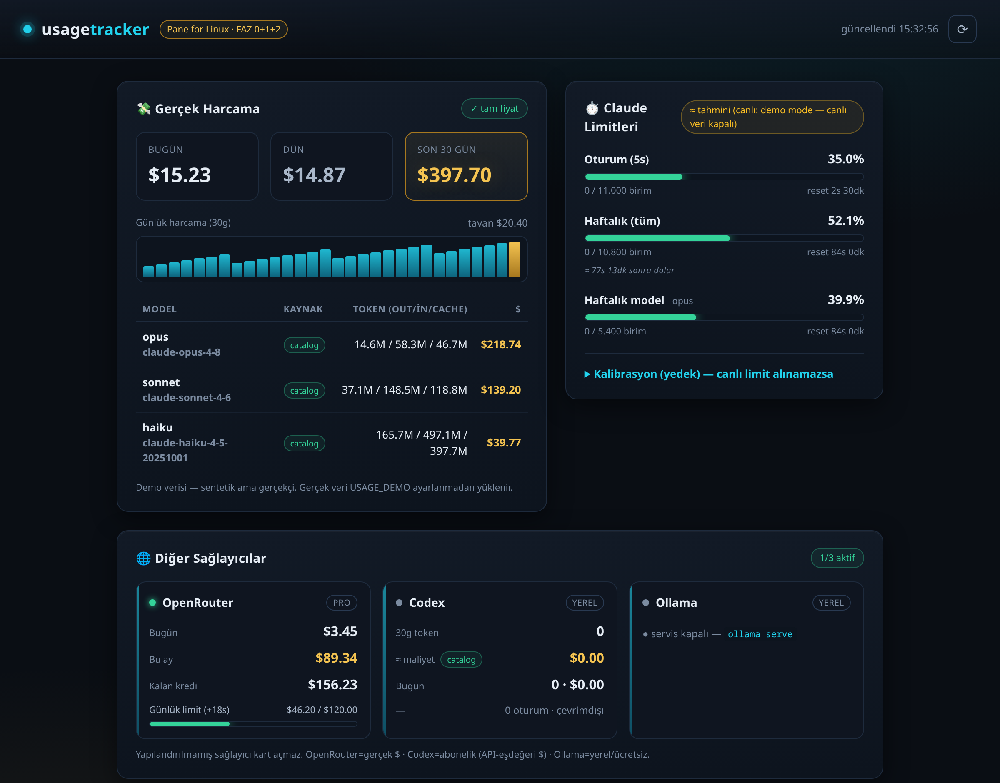
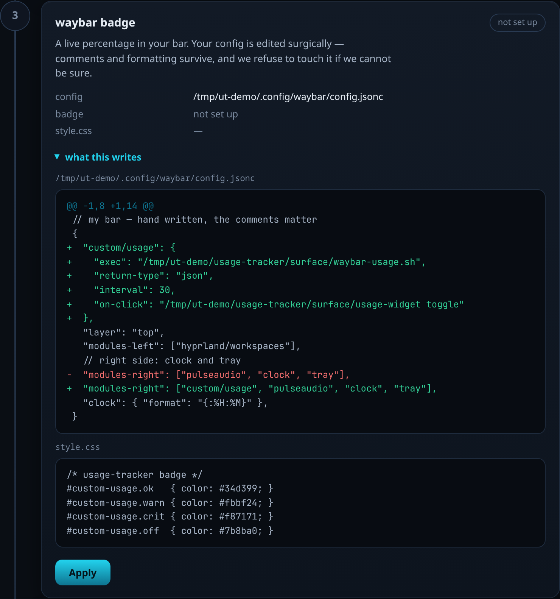

# usage-tracker — a "Pane for Linux"

A tiny, dependency-free tool that shows **all your AI usage, rate limits, and real $ spend** in one place on Linux — a native alternative to [Pane](https://github.com/ItsJazii/pane) (Windows-only).

- **Web panel** at `http://127.0.0.1:8770` — spend cards, 30-day chart, per-model table, live limit bars.
- **waybar badge** — `◐ 64%` in your bar, colored by how close you are to the wall.
- **floating widget** — the panel as a movable, resizable, always-on-top window.
- **guided setup** — `./setup.sh`, or `./setup.sh --ui` for the same steps in a browser window.
  Every step shows a real diff of what it is about to write, and can be undone from the same page.

Built with **stdlib Python + Vanilla JS**. No `pip install`, no Node, no Rust. Loopback-only.

> 🇹🇷 Türkçe: [README.tr.md](README.tr.md)



> Demo with sample data; actual spend and limits will reflect your real providers.

---

## Why

If you use Claude Code, Codex, OpenRouter, Ollama etc., your spend and rate-limit status are scattered across dashboards — or invisible. usage-tracker reads what's already on your disk (transcripts) plus the providers' own live endpoints, and surfaces it where you can glance at it.

## Install

```bash
git clone https://github.com/ihsandeniz/usage-tracker.git
cd usage-tracker
./setup.sh            # ★ guided wizard: deps → server → waybar → widget/tray → keys → verify
```

Rather click than type? `./setup.sh --ui` runs the same six steps in a browser window —
each one showing a real diff of what it is about to write, with an Undo button next to it.



```bash
./setup.sh --ui         # the wizard as a page (opens a window; prints the URL either way)
./setup.sh --auto       # non-interactive: recommended answer for every question
./setup.sh --uninstall  # undo everything the wizard set up (keys and repo stay)
./setup.sh --help
```

The terminal wizard stays the default, because it is the one that works over SSH, on a
headless box, and in a dotfiles script. Both faces call the same code — `setup.sh probe`,
`setup.sh do <step>`, `setup.sh undo <step>` — so they cannot drift apart.

What the wizard will and won't do to your system:

- **Backs up every file it touches** as `<file>.bak-usage-tracker`.
- **Edits your waybar config surgically** — comments and formatting survive. It parses the file
  before and after, and rolls back if the result isn't valid JSONC.
- **Refuses to guess.** Unparseable config, or a `modules-*` list that lives in an `include`?
  It leaves the file alone and hands you the snippet (on your clipboard) to paste yourself.
- **Idempotent.** Re-run it as often as you like; already-done steps are no-ops.
- **Imports API keys you already exported in your shell** into the keys file — because shell
  exports never reach the autostarted service, which used to leave cards silently empty.
- **Verifies instead of promising**: at the end it queries the server, counts resolved provider
  cards, and runs the waybar feeder once to show you its real output.
- No root, no network calls, nothing outside `~/.config` and this repo.

### Why `--ui` is a separate, temporary server

The long-running server (`:8770`) is **read-only**, and that is what lets this tool claim
nothing leaves your machine. Endpoints that edit your waybar config or touch your API keys
do not belong there, because a browser can be tricked into calling a localhost server: any
page you have open can POST to `127.0.0.1` (CORS blocks reading the reply, not sending the
request), and a domain that resolves to `127.0.0.1` becomes same-origin and can read replies
too. So `--ui` starts a **separate** server that

- picks an ephemeral port and mints a one-time token, passed in the URL fragment
  (fragments are never sent to a server, so the token cannot land in a log);
- rejects any request whose `Host` is not `127.0.0.1:<port>` — this is what stops DNS rebinding;
- rejects any request with a foreign `Origin`, and any API call without the token;
- **never returns a key value** — you can set or remove a key, never read one back;
- exits when you press Finish, or after ten idle minutes.

Key values reach `setup.sh` over stdin, never argv, which is world-readable in `/proc`.

Prefer to do it by hand? Skip the wizard:

```bash
./install.sh          # checks deps, generates config + keys file, prints snippets
./start.sh            # → http://127.0.0.1:8770
```

**Requirements:** Python 3.9+ (stdlib). `curl` + `jq` for the waybar feeder. A Chromium-family
browser (optional, for the floating widget), `hyprctl` (optional, auto-floats the widget on
Hyprland), `wl-copy`/`xclip` (optional, lets the wizard copy the waybar snippet). `install.sh`
reports what's missing.

## Autostart (recommended)

So the badge always has data, run the server on login. One command, no root — a **systemd user service** (works on any systemd distro):

```bash
./service.sh install      # generate + enable + start on login
./service.sh status       # check it
./service.sh uninstall    # remove it
```

Only the server needs autostart; the waybar badge and the floating widget attach to it.

<details><summary>Autostart without systemd</summary>

**Hyprland** (`hyprland.conf`):
```
exec-once = /ABS/PATH/start.sh
```

**Generic XDG autostart** — create `~/.config/autostart/usage-tracker.desktop`:
```ini
[Desktop Entry]
Type=Application
Name=usage-tracker
Exec=/ABS/PATH/start.sh
X-GNOME-Autostart-enabled=true
```
</details>

## Provider keys

Claude Code, Codex and local runners (Ollama / LM Studio / Jan) need **no key** — they read files already on your disk. Hosted providers need an API key to show a card. A missing key just hides that card (**no dead cards**) — nothing breaks.

Keys live in **one file**, `~/.config/usage-tracker/env` (created by `install.sh`/`setup.sh`, `chmod 600`). It's loaded by both `./start.sh` and the systemd service, so keys work whether you run the server by hand or on login. Format is `KEY=value`, one per line — uncomment what you use:

| Provider | Env var | Shows | Endpoint | Get a key |
|---|---|---|---|---|
| OpenRouter | `OPENROUTER_API_KEY` | spend + credit + daily limit | ✅ exists | <https://openrouter.ai/keys> |
| OpenAI | `OPENAI_ADMIN_KEY` | Costs API spend — needs an **admin** key (project key → 401) | ✅ exists | Platform → *Admin keys* |
| DeepSeek | `DEEPSEEK_API_KEY` | balance | ✅ exists | <https://platform.deepseek.com> |
| ElevenLabs | `ELEVENLABS_API_KEY` | character quota + monthly reset | ✅ exists | ElevenLabs → *Profile* |
| Novita | `NOVITA_API_KEY` | credit balance | ✅ exists | <https://novita.ai/settings/key-management> |
| DeepInfra | `DEEPINFRA_API_KEY` | credit balance | ✅ exists | DeepInfra → *API keys* |
| Hugging Face | `HUGGINGFACE_API_KEY` / `HF_TOKEN` | quota | ✅ exists | <https://huggingface.co/settings/tokens> |
| Together | `TOGETHER_API_KEY` | **nothing — see below** | 🔴 none published | <https://api.together.xyz/settings/api-keys> |

After editing keys, restart the server: `./service.sh restart` (or re-run `./start.sh`).

### How far these are verified

On 2026-08-11 every endpoint above was probed **without credentials**. A `401` proves the
URL exists and wants a key; a `404` proves the adapter would never have worked. Everything
marked ✅ came back `401` (or `400` for Novita, which wants a parameter).

**Together AI is the exception and it is worth being blunt about.** Its API base is real —
`/v1/models` answers `401 Missing API key` — but it publishes no account, balance or usage
endpoint at all: seven candidate paths all returned `404` with an HTML page, on both
`api.together.xyz` and `api.together.ai`. The adapter used to scan those non-existent
responses for any field named `balance`/`credit`/`remaining` and print the first number it
found. It now validates your key and says plainly that Together exposes nothing to read.

What is **still unverified** is the response *shape* behind those 401s — nobody here has a
key for these services, so the field names inside a successful reply have not been seen. If
an adapter meets a payload it does not recognise it says so and shows no figure; it will
not invent one. Amount scanning is deliberately narrow (`usage/providers/_money.py`): a
boolean is not an amount, and a `remaining` buried in some unrelated rate-limit object is
not your balance.

## What it tracks

| Dimension | What | Source |
|---|---|---|
| **Spend** | Today / Yesterday / 30-day **$** + per-model + 30-day chart | `~/.claude/projects/**/*.jsonl` tokens × real prices |
| **Limits** | Session (5h) + Weekly usage %, reset countdown | Anthropic's own `/api/oauth/usage` (real), local estimate as fallback |
| **Providers** | 16 adapters: real $ (OpenRouter, OpenAI, DeepSeek), credit/quota (ElevenLabs, HuggingFace, Novita, DeepInfra), local (Ollama, LM Studio, Jan), local-log tokens (Codex, Aider, Continue, Cody, Windsurf), key-check only (Together — it publishes no usage endpoint) | each provider's API / local files |

### Is the data real?

Trust matters, so every number is labelled by source — nothing is silently made up:

- **Token counts: 100% real** — read from transcripts, not estimated.
- **Prices: real** — Opus/Sonnet/Haiku from the [models.dev](https://models.dev) catalog (`source: catalog`); models not yet in the catalog use official vendor pricing (`source: official`). Anything unverified is flagged `source: estimate`.
- **Prices work offline, out of the box** — a models.dev snapshot ships inside the repo, so a fresh clone prices your usage on the first run with no network and no other tool installed. Refresh it whenever you like: `python3 -m usage.catalog --update`. Run `python3 -m usage.catalog` to see which source is in use and how old it is.
- **A model nobody has priced is not counted as $0.** Its tokens are reported separately in `unknownPriceModels` and left out of the totals, so a total that is incomplete says so instead of quietly looking finished.
- **A scan that stopped early says so** — the local-log adapters cap how much they read; when they hit that cap the card reads `partial` and explains itself, rather than presenting a truncated number as your usage.
- **Limits: real, no calibration** — pulled from the same endpoint Claude Code's `/usage` uses.
- **If you're on a subscription (Max, ChatGPT Plus…),** the $ figure is the **API-equivalent cost** (what this usage would cost pay-as-you-go) = the value you're getting from the subscription. Your actual bill is the flat fee, not this number.
- **Can't be separated:** Opus fast-mode and 1M-context premium pricing don't appear in the transcript's model field, so they're computed at standard rates (real cost may be slightly higher).

## The surface — two independent options

Everything under `surface/` is **isolated** (it never touches your existing `~/.config/waybar` or
`~/.config`) and the two surfaces are **independent** — install the waybar badge, the floating
widget, both, or neither. Neither depends on the other.

### Option A — waybar badge

A compact `◐ NN%` module in your bar; the headline is the highest Claude limit %, the tooltip
lists every provider, and clicking it opens the web panel. `install.sh` prints the ready-to-paste
`custom/usage` snippet + `style.css` colors. Standalone — no browser required.

### Option B — floating widget

The web panel as a **movable + resizable** always-on-top window (a Chromium-family `--app`
window). Unlike a bar widget, you position and size it however you like:

- **Move** it — `Super`+drag (or your compositor's move binding).
- **Resize** it — `Super`+right-drag, or drag the edges. The browser remembers your size/position.

```bash
surface/usage-widget open      # show it
surface/usage-widget close     # hide it
surface/usage-widget toggle    # show/hide (good for the waybar on-click)
surface/usage-widget status    # open / closed
```

On **Hyprland** it's auto-floated, pinned (visible on every workspace), and placed top-right at
`WIDGET_SIZE` — no config edit needed. On other compositors, float/size it with your own controls.
Requires a Chromium-family browser (chromium / chrome / brave / …). Standalone — no waybar required.

#### Desktop compatibility

The **waybar badge** works on any systemd-based Linux (Hyprland, GNOME, Plasma, etc.).  
The **floating widget** requires a Chromium-family browser and works on any Linux:
- **Hyprland:** Auto-float/pin built-in.
- **GNOME / Plasma / Cinnamon:** Float/pin it with your compositor's native controls (usually right-click title bar → Properties).
- **i3 / Openbox:** Floating layers work; consult your config for layering.

The core **web panel** (`http://127.0.0.1:8770`) runs on every Linux and every desktop environment — no special setup needed.

Autostart (Hyprland): `exec-once = /ABS/PATH/surface/usage-widget open`.

### Option C — the command line

The other two surfaces are things you look at. This one another program can ask:

```bash
python3 server.py guard --threshold 80 || echo "not now — the quota is nearly gone"
```

```
python3 server.py usage        # limits, spend and every provider card
python3 server.py providers    # which cards exist, and why one is missing
python3 server.py guard        # exit 0 ok · 1 warn · 2 critical · 3 unknown
python3 server.py watch        # fire once per threshold crossing (--exec / --notify)
python3 server.py doctor       # diagnose an installation without asking for logs
python3 server.py config       # which cards are visible
```

No server needed (it computes locally when nothing answers on `:8770`), and no bash, curl or
jq — which is how Windows gets a usable surface while the `.sh` feeders stay Linux-only.
`usage --format waybar` is the bar feeder without the shell. The single-file build is the
same binary: `usage-tracker guard`.

Full reference, including the exit-code contract and the `UT_*` variables `watch --exec`
sets: [`docs/CLI.md`](docs/CLI.md).

## Configuration

### Where your data lives

Nothing is written into the installation directory — it may be read-only (a PyInstaller
bundle, `Program Files`, `/usr/lib`, a container). Run `python3 -m usage.platform` to print
the exact paths on your machine.

| | Linux / BSD | Windows |
|---|---|---|
| view config | `~/.config/usage-tracker/` | `%APPDATA%\usage-tracker\` |
| calibration, live cache | `~/.local/state/usage-tracker/` | `%LOCALAPPDATA%\usage-tracker\State\` |
| fetched price catalogue | `~/.cache/usage-tracker/` | `%LOCALAPPDATA%\usage-tracker\Cache\` |

`XDG_CONFIG_HOME` / `XDG_STATE_HOME` / `XDG_CACHE_HOME` are honoured. Upgrading from an
older version keeps working: a `usage_calib.json` or `view_config.json` sitting next to the
code is still read, and the next save moves it. Nobody has to recalibrate.

`surface/surface.conf` (created by `install.sh`, git-ignored — machine-specific):

```sh
USAGE_URL="http://127.0.0.1:8770"
WIDGET_SIZE="360x520"                 # floating widget initial size (you can drag/resize after)
WIDGET_CLASS="usage-tracker-widget"
```

### Adding providers

Provider adapters live in `usage/providers/`. Each module exposes `collect(days) -> dict | None`; returning `None` means "no card" (a missing/unconfigured provider is silently hidden — **no dead cards**). To add one, drop `usage/providers/<name>.py` and register it in `_ADAPTERS`. OpenRouter reads `$OPENROUTER_API_KEY` from the environment.

## HTTP endpoints

| Endpoint | Returns |
|---|---|
| `GET /api/spend?days=30` | Today/Yesterday/30d $ + byModel + byDay |
| `GET /api/usage` | Claude limit panel (`source: live\|calibration`) |
| `GET /api/live[?force=1]` | Raw Anthropic live usage (verification) |
| `GET /api/providers` | Multi-provider cards |
| `GET /v1/usage` | Stable wire-format (`schema: usage/v1`) — used by the waybar feeder |

`/v1/usage` is a public contract, not an internal detail: four surfaces here read it and so may
your scripts. The fields, the compatibility rules and what changed when are in
[`docs/WIRE.md`](docs/WIRE.md).

## Security & privacy

- Binds **`127.0.0.1` only** — never exposed to the network.
- **Read-only** to your data. OAuth tokens in `~/.claude/.credentials.json` are only *read*, never written or refreshed (writing could drop your active session).
- No telemetry, no external calls except the providers' own APIs you already use.
- Static file serving is path-traversal protected.

## Development

```bash
python3 -m unittest discover -s tests -t .   # the test suite — stdlib only, nothing to install
python3 server.py --version                  # single source of truth, CI checks it against the git tag
python3 -m usage.pricing                     # price-resolution spot-check
python3 -m usage.engine                      # limits + $ summary from real transcripts (no server)
python3 -m usage.catalog                     # which price catalogue is in use, and how old
```

The test suite has **no test dependencies** — same promise as the runtime. CI runs it on Ubuntu
and Windows, on Python 3.9 and 3.13, with no install step. Read `tests/README.md` before adding
to it; the short version is *write the failing test first, and assert the number, not the shape*.

## Roadmap

- [x] Spend + real prices, live Claude limits (no calibration)
- [x] Multi-provider adapters — 16 across 4 kinds (spend / tokens / local / quota)
  - real $: OpenRouter, OpenAI (Costs API, admin key), DeepSeek *(balance API — documented, candidate)*
  - credit/quota: ElevenLabs, HuggingFace, Together, Novita, DeepInfra *(some candidate — verify with a live key)*
  - local ($0): Ollama, LM Studio, Jan
  - local-log tokens: Codex, Aider, Continue, Cody, Windsurf
- [x] waybar badge + movable/resizable floating widget
- [x] Per-provider data selection (⚙ View tab → `view_config.json`; waybar/widget/panel obey)
- [x] Optional native system-tray icon (Qt `QSystemTrayIcon`; SNI → waybar tray)
- [x] CLI — `usage` / `providers` / `guard` / `watch` / `doctor` / `config`, with a documented
      exit-code contract for scripts ([`docs/CLI.md`](docs/CLI.md))
- [ ] Verify candidate endpoints (Together / Novita / DeepInfra / HuggingFace / DeepSeek) against live keys

## Contributing

Issues and PRs welcome. The design constraints are deliberate: **stdlib Python + Vanilla JS, zero runtime dependencies, loopback-only, every number labelled by source.** Please keep them.

## License

[MIT](LICENSE) © 2026 İhsan Deniz
